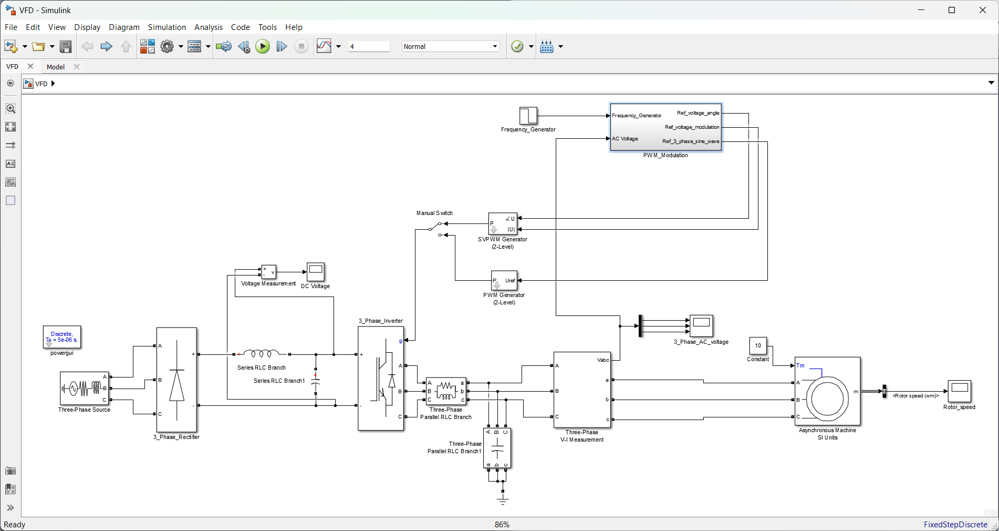
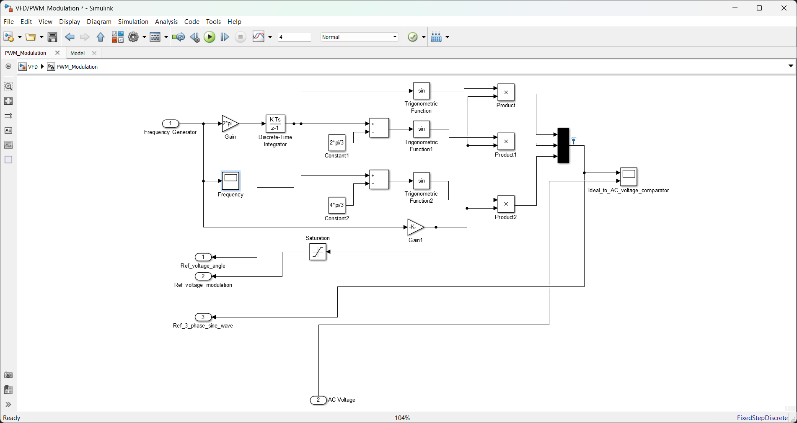
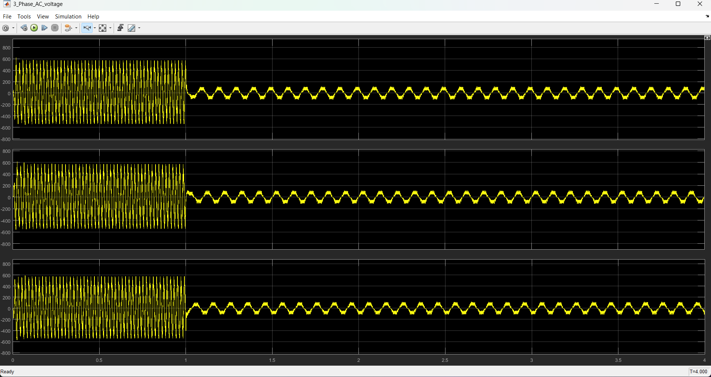
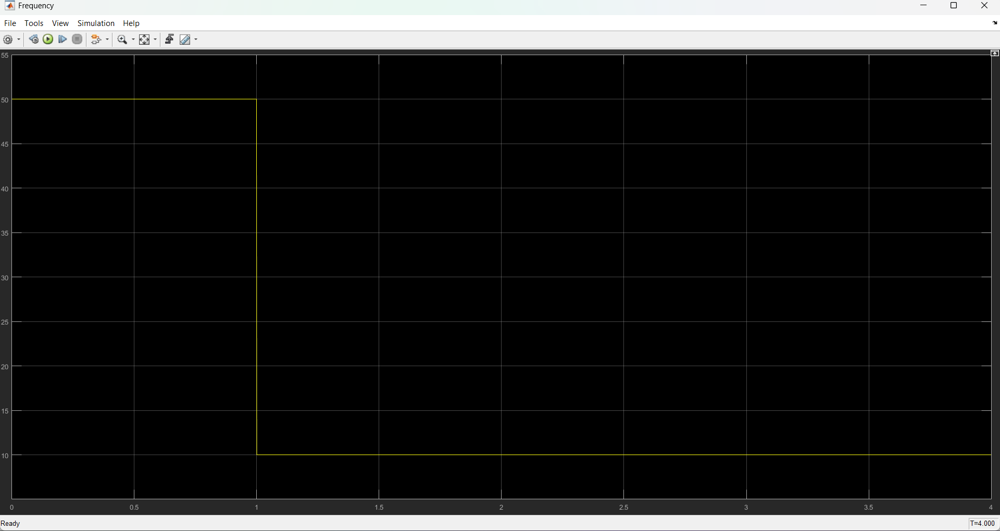

# V/F Controlled Induction Motor Drive using PWM & SVPWM (MATLAB/Simulink)

## Project Overview
This project models a **Variable Frequency Drive (VFD)** for a three-phase induction motor using MATLAB/Simulink.  
It implements **V/f control** and compares:

- Sinusoidal PWM (SPWM)  
- Space Vector PWM (SVPWM)

The simulation demonstrates how voltage is adjusted proportionally with frequency to control motor speed.

---

## Objectives
- Build a rectifier–inverter VFD model  
- Implement constant V/f control  
- Compare SPWM and SVPWM  
- Observe motor speed response  
- Smooth inverter output using LC filter  

---

## Tools Used
- MATLAB  
- Simulink  
- Simscape Electrical  

---

## System Architecture

The simulation model consists of the following main blocks:

- Three-phase AC source  
- Diode bridge rectifier  
- DC link capacitor  
- Three-phase voltage source inverter  
- PWM/SVPWM controller  
- LC output filter  
- Three-phase squirrel cage induction motor  

---

## Main Simulink Model



---

## PWM Modulation Subsystem



This subsystem generates:
- Reference frequency signal  
- Modulation index calculation  
- Three-phase sinusoidal reference signals  
- PWM/SVPWM switching pulses for inverter control  

---

## V/f Control Principle

\[
V \propto f
\]

When frequency decreases from **50 Hz → 10 Hz**,  
the inverter voltage also decreases proportionally.

This keeps motor flux constant and prevents saturation.

---

## Simulation Inputs

| Parameter         | Value  |
|-------------------|--------|
| Initial frequency | 50 Hz  |
| Final frequency   | 10 Hz  |
| Step time         | 1 s    |
| Load torque       | 10 Nm  |
| PWM frequency     | 5 kHz  |  

---

## Simulation Results

### Rotor Speed


---

### Three-Phase Voltage


---

### Frequency Input


---

## SPWM vs SVPWM

| Feature              | SPWM     | SVPWM   |
|---------------------|----------|---------|
| Voltage utilization | Lower    | Higher  |
| THD                 | Higher   | Lower   |
| Efficiency          | Moderate | Better  |

SVPWM provides smoother output and better DC bus utilization.

---

## Output Filter Used

Series RL:
- R = 0.5 Ω  
- L = 0.1 mH  

Shunt C:
- C = 600 µF  

This reduces switching ripple.

---

## Project Structure

```
VFD_Simulink_Project/
│
├── VFD.slx                  # Main Simulink model
├── PWM_Modulation.slx       # PWM subsystem model
├── README.md                # Project documentation
│
└── docs/                    # Documentation assets
    ├── main_model.png       # Main system architecture diagram
    ├── pwm_subsystem.png    # PWM modulation subsystem
    ├── rotor_speed.png      # Rotor speed simulation results
    ├── phase_voltage.png    # Three-phase voltage waveforms
    └── frequency.png        # Frequency input signal
```


## Prerequisites

Before running this project, ensure you have the following installed:

- **MATLAB** (R2018b or later recommended)
- **Simulink**
- **Simscape Electrical** toolbox

---

## How to Run

1. **Clone the repository:**
   ```bash
   git clone https://github.com/YourUsername/VFD_Simulink_Project.git
   cd VFD_Simulink_Project
   ```

2. **Open MATLAB:**
   Launch MATLAB on your system.

3. **Load the Simulink model:**
   Open the main model file `VFD.slx`.

4. **Run the simulation:**
   Click the "Run" button in Simulink to start the simulation.

5. **Modify parameters (optional):**
   - Adjust frequency step values in the model
   - Toggle between PWM and SVPWM modes
   - Change load torque or other parameters

6. **Observe results:**
   View the simulation results in the scope blocks for:
   - Rotor speed
   - Phase voltages
   - Frequency response  

---

## Learning Outcomes

- Understanding V/f motor control principles  
- Comparative analysis of PWM and SVPWM techniques  
- Induction motor modeling and simulation  
- Power electronics circuit design and implementation  

---

## Future Improvements
- Closed-loop speed control  
- Field-oriented control  
- Hardware prototype  
- EV motor drive integration  

---

## Author

**Priyanshu Nayak**  
B.Tech Electrical Engineering  

---

## License

This project is intended for academic and educational purposes.